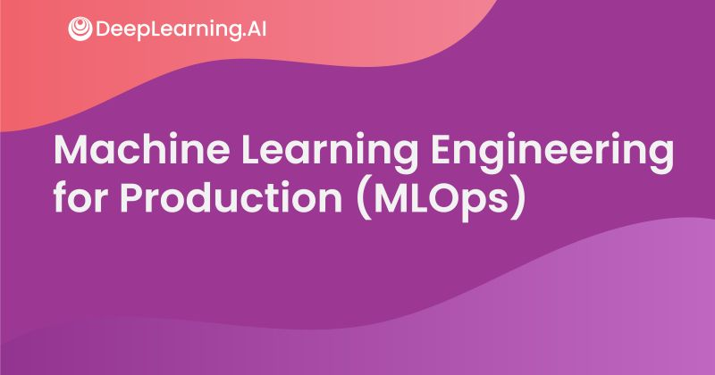

# Machine Learning Engineering for Production (MLOps) Specialization on Coursera (offered by deeplearning.ai)

Programming assignments from all courses in the Coursera [Machine Learning Engineering for Production (MLOps)](https://www.deeplearning.ai/generative-adversarial-networks-specialization/) Specialization offered by `deeplearning.ai`.

## Courses

The GAN Specialization on Coursera contains three courses:

1. [Course 1: Introduction to Machine Learning in Production](https://www.coursera.org/learn/introduction-to-machine-learning-in-production?specialization=machine-learning-engineering-for-production-mlops)

1. [Course 2: Machine Learning Data Lifecycle in Production](https://www.coursera.org/learn/machine-learning-data-lifecycle-in-production?specialization=machine-learning-engineering-for-production-mlops)

1. [Course 3: Machine Learning Modeling Pipelines in Production](https://www.coursera.org/learn/machine-learning-modeling-pipelines-in-production?specialization=machine-learning-engineering-for-production-mlops)

1. [Course 4: Deploying Machine Learning Models in Production](https://www.coursera.org/learn/deploying-machine-learning-models-in-production?specialization=machine-learning-engineering-for-production-mlops)

## Why this Specialization? 

- Become a Machine Learning expert. Productionize your machine learning knowledge and expand your production engineering capabilities.

- **Skills:** Managing Machine Learning Production Systems, Deployment Pipelines, Model Pipelines, Data Pipelines, Machine Learning Engineering for Production, Human-level Performance (HLP), Concept Drift, Model Baseline, Project Scoping and Design, ML Deployment Challenges, ML Metadata, Convolutional Neural Network

- **Level:** Advanced
	- Some knowledge of AI / deep learning
	- Intermediate skills in Python
	- Experience with any deep learning framework (PyTorch, Keras, or TensorFlow)

## About this Specialization

- Understanding machine learning and deep learning concepts is essential, but if you’re looking to build an effective AI career, you need production engineering capabilities as well. 

- Effectively deploying machine learning models requires competencies more commonly found in technical fields such as software engineering and DevOps. Machine learning engineering for production combines the foundational concepts of machine learning with the functional expertise of modern software development and engineering roles. 

- The Machine Learning Engineering for Production (MLOps) Specialization covers how to conceptualize, build, and maintain integrated systems that continuously operate in production. In striking contrast with standard machine learning modeling, production systems need to handle relentless evolving data. Moreover, the production system must run non-stop at the minimum cost while producing the maximum performance. In this Specialization, you will learn how to use well-established tools and methodologies for doing all of this effectively and efficiently.

- In this Specialization, you will become familiar with the capabilities, challenges, and consequences of machine learning engineering in production. By the end, you will be ready to employ your new production-ready skills to participate in the development of leading-edge AI technology to solve real-world problems.

## Applied Learning Project

By the end, you'll be ready to:
- Design an ML production system end-to-end: project scoping, data needs, modeling strategies, and deployment requirements
- Establish a model baseline, address concept drift, and prototype how to develop, deploy, and continuously improve a productionized ML application
- Build data pipelines by gathering, cleaning, and validating datasets
- Implement feature engineering, transformation, and selection with TensorFlow Extended
- Establish data lifecycle by leveraging data lineage and provenance metadata tools and follow data evolution with enterprise data schemas
- Apply techniques to manage modeling resources and best serve offline/online inference requests
- Use analytics to address model fairness, explainability issues, and mitigate bottlenecks
- Deliver deployment pipelines for model serving that require different infrastructures
- Apply best practices and progressive delivery techniques to maintain a continuously operating production system

## Programming Assignments

### Course 1: Introduction to Machine Learning in Production

#### Week 1

- Ungraded Quiz:
	- [The Machine Learning Project Lifecycle](https://nbviewer.jupyter.org/github/amanchadha/coursera-machine-learning-engineering-for-prod-mlops-specialization/blob/main/C1%20-%20Introduction%20to%20Machine%20Learning%20in%20Production/Week%201/Q1%20-%20The%20Machine%20Learning%20Project%20Lifecycle.txt)
- Graded Quiz:
	- [Deployment](https://nbviewer.jupyter.org/github/amanchadha/coursera-machine-learning-engineering-for-prod-mlops-specialization/blob/main/C1%20-%20Introduction%20to%20Machine%20Learning%20in%20Production/Week%201/Q2%20-%20Deployment.txt)

#### Week 2

- Graded Quizzes:
	- [Selecting and Training a Model](https://nbviewer.jupyter.org/github/amanchadha/coursera-machine-learning-engineering-for-prod-mlops-specialization/blob/main/C1%20-%20Introduction%20to%20Machine%20Learning%20in%20Production/Week%202/Q1%20-%20Selecting%20and%20Training%20a%20Model.txt)
	- [Modeling challenges](https://nbviewer.jupyter.org/github/amanchadha/coursera-machine-learning-engineering-for-prod-mlops-specialization/blob/main/C1%20-%20Introduction%20to%20Machine%20Learning%20in%20Production/Week%202/Q2%20-%20Modeling%20challenges.txt)
- Lab:
	- [A journey through Data](https://nbviewer.jupyter.org/github/amanchadha/coursera-machine-learning-engineering-for-prod-mlops-specialization/blob/main/C1%20-%20Introduction%20to%20Machine%20Learning%20in%20Production/Week%202/C1W2_Ungraded_Lab_Birds_Cats_Dogs.ipynb)

#### Week 3

- Graded Quiz:
	- [Data Definition and Baseline](https://nbviewer.jupyter.org/github/amanchadha/coursera-machine-learning-engineering-for-prod-mlops-specialization/blob/main/C1%20-%20Introduction%20to%20Machine%20Learning%20in%20Production/Week%203/Q1%20-%20Data%20Definition%20and%20Baseline.txt)
- Lab:
	- [Data Labeling](https://nbviewer.jupyter.org/github/amanchadha/coursera-machine-learning-engineering-for-prod-mlops-specialization/blob/main/C1%20-%20Introduction%20to%20Machine%20Learning%20in%20Production/Week%203/C1W3_Data_Labeling_Ungraded_Lab.ipynb), [PDF](https://nbviewer.jupyter.org/github/amanchadha/coursera-machine-learning-engineering-for-prod-mlops-specialization/blob/main/C1%20-%20Introduction%20to%20Machine%20Learning%20in%20Production/Week%203/C1W3_Data_Labeling_Ungraded_Lab.pdf)

---

### Course 2: Machine Learning Data Lifecycle in Production

#### Week 1

- Lab:
	- [TFDV Exercise](https://nbviewer.jupyter.org/github/amanchadha/coursera-machine-learning-engineering-for-prod-mlops-specialization/blob/main/C2%20-%20Machine%20Learning%20Data%20Lifecycle%20in%20Production/Week%201/C2_W1_Lab_1_TFDV_Exercise.ipynb), [PDF](https://nbviewer.jupyter.org/github/amanchadha/coursera-machine-learning-engineering-for-prod-mlops-specialization/blob/main/C2%20-%20Machine%20Learning%20Data%20Lifecycle%20in%20Production/Week%201/C2_W1_Lab_1_TFDV_Exercise.pdf)
- Assignment:
	- [Data Validation](https://nbviewer.jupyter.org/github/amanchadha/coursera-machine-learning-engineering-for-prod-mlops-specialization/blob/main/C2%20-%20Machine%20Learning%20Data%20Lifecycle%20in%20Production/Week%201/C2W1_Assignment.ipynb), [PDF](https://nbviewer.jupyter.org/github/amanchadha/coursera-machine-learning-engineering-for-prod-mlops-specialization/blob/main/C2%20-%20Machine%20Learning%20Data%20Lifecycle%20in%20Production/Week%201/C2W1_Assignment.pdf)

#### Week 2

- Labs:
	- [Simple Feature Engineering](https://nbviewer.jupyter.org/github/amanchadha/coursera-machine-learning-engineering-for-prod-mlops-specialization/blob/main/C2%20-%20Machine%20Learning%20Data%20Lifecycle%20in%20Production/Week%202/C2_W2_Lab_1_Simple_Feature_Engineering.ipynb), [PDF](https://nbviewer.jupyter.org/github/amanchadha/coursera-machine-learning-engineering-for-prod-mlops-specialization/blob/main/C2%20-%20Machine%20Learning%20Data%20Lifecycle%20in%20Production/Week%202/C2_W2_Lab_1_Simple_Feature_Engineering.pdf)
	- [Feature Engineering Pipeline](https://nbviewer.jupyter.org/github/amanchadha/coursera-machine-learning-engineering-for-prod-mlops-specialization/blob/main/C2%20-%20Machine%20Learning%20Data%20Lifecycle%20in%20Production/Week%202/C2_W2_Lab_2_Feature_Engineering_Pipeline.ipynb), [PDF](https://nbviewer.jupyter.org/github/amanchadha/coursera-machine-learning-engineering-for-prod-mlops-specialization/blob/main/C2%20-%20Machine%20Learning%20Data%20Lifecycle%20in%20Production/Week%202/C2_W2_Lab_1_Feature_Engineering_Pipeline.pdf)
	- [Feature Selection](https://nbviewer.jupyter.org/github/amanchadha/coursera-machine-learning-engineering-for-prod-mlops-specialization/blob/main/C2%20-%20Machine%20Learning%20Data%20Lifecycle%20in%20Production/Week%202/C2_W2_Lab_3_Feature_Selection.ipynb), [PDF](https://nbviewer.jupyter.org/github/amanchadha/coursera-machine-learning-engineering-for-prod-mlops-specialization/blob/main/C2%20-%20Machine%20Learning%20Data%20Lifecycle%20in%20Production/Week%202/C2_W2_Lab_3_Feature_Selection.pdf)
- Assignment:
	- [Feature Engineering](https://nbviewer.jupyter.org/github/amanchadha/coursera-machine-learning-engineering-for-prod-mlops-specialization/blob/main/C2%20-%20Machine%20Learning%20Data%20Lifecycle%20in%20Production/Week%202/C2W2_Assignment.ipynb)	

#### Week 3

- Labs:
	- [ML Metadata](https://nbviewer.jupyter.org/github/amanchadha/coursera-machine-learning-engineering-for-prod-mlops-specialization/blob/main/C2%20-%20Machine%20Learning%20Data%20Lifecycle%20in%20Production/Week%203/C2_W3_Lab_1_MLMetadata.ipynb), [PDF](https://nbviewer.jupyter.org/github/amanchadha/coursera-machine-learning-engineering-for-prod-mlops-specialization/blob/main/C2%20-%20Machine%20Learning%20Data%20Lifecycle%20in%20Production/Week%203/C2_W3_Lab_1_MLMetadata.pdf)
	- [Iterative Schema](https://nbviewer.jupyter.org/github/amanchadha/coursera-machine-learning-engineering-for-prod-mlops-specialization/blob/main/C2%20-%20Machine%20Learning%20Data%20Lifecycle%20in%20Production/Week%203/C2_W3_Lab_2_IterativeSchema.ipynb), [PDF](https://nbviewer.jupyter.org/github/amanchadha/coursera-machine-learning-engineering-for-prod-mlops-specialization/blob/main/C2%20-%20Machine%20Learning%20Data%20Lifecycle%20in%20Production/Week%203/C2_W3_Lab_2_IterativeSchema.pdf)
- Assignment:
	- [Data Pipeline Components for Production ML](https://nbviewer.jupyter.org/github/amanchadha/coursera-machine-learning-engineering-for-prod-mlops-specialization/blob/main/C2%20-%20Machine%20Learning%20Data%20Lifecycle%20in%20Production/Week%203/C2W3_Assignment.ipynb)	

#### Week 4

- Labs:
	- [Feature Engineering with Weather Data](https://nbviewer.jupyter.org/github/amanchadha/coursera-machine-learning-engineering-for-prod-mlops-specialization/blob/main/C2%20-%20Machine%20Learning%20Data%20Lifecycle%20in%20Production/Week%204/C2_W4_Lab_1_WeatherData.ipynb)
	- [Feature Engineering with Accelerometer Data](https://nbviewer.jupyter.org/github/amanchadha/coursera-machine-learning-engineering-for-prod-mlops-specialization/blob/main/C2%20-%20Machine%20Learning%20Data%20Lifecycle%20in%20Production/Week%204/C2_W4_Lab_2_Signals.ipynb), [PDF](https://nbviewer.jupyter.org/github/amanchadha/coursera-machine-learning-engineering-for-prod-mlops-specialization/blob/main/C2%20-%20Machine%20Learning%20Data%20Lifecycle%20in%20Production/Week%204/C2_W4_Lab_2_Signals.pdf)
	- [Feature Engineering with Images](https://nbviewer.jupyter.org/github/amanchadha/coursera-machine-learning-engineering-for-prod-mlops-specialization/blob/main/C2%20-%20Machine%20Learning%20Data%20Lifecycle%20in%20Production/Week%204/C2_W4_Lab_3_Images.ipynb), [PDF](https://nbviewer.jupyter.org/github/amanchadha/coursera-machine-learning-engineering-for-prod-mlops-specialization/blob/main/C2%20-%20Machine%20Learning%20Data%20Lifecycle%20in%20Production/Week%204/C2_W4_Lab_3_Images.pdf)

---

### Course 3: Machine Learning Modeling Pipelines in Production

#### Week 1

- Graded Quiz:
	- [Hyperparameter Tuning and Neural Architecture Search](https://raw.githubusercontent.com/saikhu/coursera-machine-learning-engineering-for-prod-mlops-specialization/main/C3%20-%20Machine%20Learning%20Modeling%20Pipelines%20in%20Production/Week%201/Q1%20-%20Hyperparameter%20Tuning%20and%20Neural%20Architecture%20Search.txt)
	- [AutoML](https://raw.githubusercontent.com/saikhu/coursera-machine-learning-engineering-for-prod-mlops-specialization/main/C3%20-%20Machine%20Learning%20Modeling%20Pipelines%20in%20Production/Week%201/Q2%20-%20AutoML.txt)
- Ungraded Labs:
	- [Intro to Keras Tuner](https://nbviewer.org/github/saikhu/coursera-machine-learning-engineering-for-prod-mlops-specialization/blob/main/C3%20-%20Machine%20Learning%20Modeling%20Pipelines%20in%20Production/Week%201/C3_W1_Lab_1_Keras_Tuner.ipynb)
	- [Hyperparameter tuning and model training with TFX](https://nbviewer.org/github/saikhu/coursera-machine-learning-engineering-for-prod-mlops-specialization/blob/main/C3%20-%20Machine%20Learning%20Modeling%20Pipelines%20in%20Production/Week%201/C3_W1_Lab_2_TFX_Tuner_and_Trainer.ipynb)

#### Week 2

- Graded Quiz
	- [Dimensionality Reduction](https://raw.githubusercontent.com/saikhu/coursera-machine-learning-engineering-for-prod-mlops-specialization/main/C3%20-%20Machine%20Learning%20Modeling%20Pipelines%20in%20Production/Week%202/Q1%20-%20Dimensionality%20Reduction.txt)
	- [Quantization and Purning](https://raw.githubusercontent.com/saikhu/coursera-machine-learning-engineering-for-prod-mlops-specialization/main/C3%20-%20Machine%20Learning%20Modeling%20Pipelines%20in%20Production/Week%202/Q2%20-%20Quantization%20and%20Purning.txt)
- Ungraded Labs
	- [Manual Dimensionality](https://nbviewer.org/github/saikhu/coursera-machine-learning-engineering-for-prod-mlops-specialization/blob/main/C3%20-%20Machine%20Learning%20Modeling%20Pipelines%20in%20Production/Week%202/C3_W2_Lab_1_Manual_Dimensionality.ipynb)
	- [Algorithmic_Dimensionality](https://nbviewer.org/github/saikhu/coursera-machine-learning-engineering-for-prod-mlops-specialization/blob/main/C3%20-%20Machine%20Learning%20Modeling%20Pipelines%20in%20Production/Week%202/C3_W2_Lab_2_Algorithmic_Dimensionality.ipynb)
	- [Quantization and Pruning](https://nbviewer.org/github/saikhu/coursera-machine-learning-engineering-for-prod-mlops-specialization/blob/main/C3%20-%20Machine%20Learning%20Modeling%20Pipelines%20in%20Production/Week%202/C3_W2_Lab_3_Quantization_and_Pruning.ipynb)

#### Week 3
- Labs
	- [Distributed Strategies with TF and Keras](https://nbviewer.org/github/saikhu/coursera-machine-learning-engineering-for-prod-mlops-specialization/blob/main/C3%20-%20Machine%20Learning%20Modeling%20Pipelines%20in%20Production/Week%203/C3_W3_Lab_1_Distributed_Training.ipynb)
	- [Knowledge Distillation](https://nbviewer.org/github/saikhu/coursera-machine-learning-engineering-for-prod-mlops-specialization/blob/main/C3%20-%20Machine%20Learning%20Modeling%20Pipelines%20in%20Production/Week%203/C3_W3_Lab_2_Knowledge_Distillation.ipynb)
- Quiz
	- [High-Performance Modeling](https://raw.githubusercontent.com/saikhu/coursera-machine-learning-engineering-for-prod-mlops-specialization/main/C3%20-%20Machine%20Learning%20Modeling%20Pipelines%20in%20Production/Week%203/Q1%20-%20High-Performance%20Modeling.txt)
	- [Knowledge Distillation](https://raw.githubusercontent.com/saikhu/coursera-machine-learning-engineering-for-prod-mlops-specialization/main/C3%20-%20Machine%20Learning%20Modeling%20Pipelines%20in%20Production/Week%203/Q2%20-%20Knowledge%20Distillation.txt)
#### Week 4
- Labs
	- [TensorFlow Model Analysis](https://nbviewer.org/github/saikhu/coursera-machine-learning-engineering-for-prod-mlops-specialization/blob/main/C3%20-%20Machine%20Learning%20Modeling%20Pipelines%20in%20Production/Week%204/C3_W4_Lab_1_TFMA.ipynb)
	- [Model Analysis with TFX Evaluator](https://nbviewer.org/github/saikhu/coursera-machine-learning-engineering-for-prod-mlops-specialization/blob/main/C3%20-%20Machine%20Learning%20Modeling%20Pipelines%20in%20Production/Week%204/C3_W4_Lab_2_TFX_Evaluator.ipynb)
	- [Fairness Indicators](https://nbviewer.org/github/saikhu/coursera-machine-learning-engineering-for-prod-mlops-specialization/blob/main/C3%20-%20Machine%20Learning%20Modeling%20Pipelines%20in%20Production/Week%204/C3_W4_Lab_3_Fairness_Indicators.ipynb)
- Quiz
	- [Model Analysis](https://raw.githubusercontent.com/saikhu/coursera-machine-learning-engineering-for-prod-mlops-specialization/main/C3%20-%20Machine%20Learning%20Modeling%20Pipelines%20in%20Production/Week%204/Q1%20-%20Model%20Analysis.txt)
	- [Model Analysis and Debugging](https://raw.githubusercontent.com/saikhu/coursera-machine-learning-engineering-for-prod-mlops-specialization/main/C3%20-%20Machine%20Learning%20Modeling%20Pipelines%20in%20Production/Week%204/Q2-%20Model%20Analysis%20and%20Debugging.txt)
	- [Continuous Evaluation and Monitoring](https://raw.githubusercontent.com/saikhu/coursera-machine-learning-engineering-for-prod-mlops-specialization/main/C3%20-%20Machine%20Learning%20Modeling%20Pipelines%20in%20Production/Week%204/Q3%20-%20Continuous%20Evaluation%20and%20Monitoring.txt)
#### Week 5
- Labs
	- [Shapley Values](https://nbviewer.org/github/saikhu/coursera-machine-learning-engineering-for-prod-mlops-specialization/blob/main/C3%20-%20Machine%20Learning%20Modeling%20Pipelines%20in%20Production/Week%205/C3_W5_Lab_1_Shap_Values.ipynb)
	- [Permutation Feature Importance](https://nbviewer.org/github/saikhu/coursera-machine-learning-engineering-for-prod-mlops-specialization/blob/main/C3%20-%20Machine%20Learning%20Modeling%20Pipelines%20in%20Production/Week%205/C3_W5_Lab_2_Permutation_Importance.ipynb)

- Quiz
	- [Explainable AI](https://raw.githubusercontent.com/saikhu/coursera-machine-learning-engineering-for-prod-mlops-specialization/main/C3%20-%20Machine%20Learning%20Modeling%20Pipelines%20in%20Production/Week%205/Q1%20-%20Explainable%20AI.txt)
	- [Interpretability](https://raw.githubusercontent.com/saikhu/coursera-machine-learning-engineering-for-prod-mlops-specialization/main/C3%20-%20Machine%20Learning%20Modeling%20Pipelines%20in%20Production/Week%205/Q2%20-%20Interpretability.txt)
	- [Understanding Model Predictions](https://raw.githubusercontent.com/saikhu/coursera-machine-learning-engineering-for-prod-mlops-specialization/main/C3%20-%20Machine%20Learning%20Modeling%20Pipelines%20in%20Production/Week%205/Q3%20-%20Understanding%20Model%20Predictions.txt)
---

### Course 4:  Welcome to Deploying Machine Learning Models in Production

#### Week 1
- Labs
	-[Intro to Docker and installation](https://github.com/saikhu/coursera-machine-learning-engineering-for-prod-mlops-specialization/blob/main/C4%20-%20Welcome%20to%20Deploying%20Machine%20Learning%20Models%20in%20Production/Week%201/C4_W1_Lab_1_Docker_Intro.md)
	-[First look at Tensorflow Serving with Docker](https://github.com/saikhu/coursera-machine-learning-engineering-for-prod-mlops-specialization/blob/main/C4%20-%20Welcome%20to%20Deploying%20Machine%20Learning%20Models%20in%20Production/Week%201/C4_W1_Lab_2_TFS_Docker.md)
	-[Serve a model with TensorFlow Serving](https://nbviewer.org/github/saikhu/coursera-machine-learning-engineering-for-prod-mlops-specialization/blob/main/C4%20-%20Welcome%20to%20Deploying%20Machine%20Learning%20Models%20in%20Production/Week%201/C4_W1_Lab_2_TF_Serving.ipynb)
- Quiz
	-[Introduction to Model Serving](https://raw.githubusercontent.com/saikhu/coursera-machine-learning-engineering-for-prod-mlops-specialization/main/C4%20-%20Welcome%20to%20Deploying%20Machine%20Learning%20Models%20in%20Production/Week%201/Q1%20-%20Introduction%20to%20Model%20Serving.txt)
	-[Introduction to Model Serving Infrastructure](https://raw.githubusercontent.com/saikhu/coursera-machine-learning-engineering-for-prod-mlops-specialization/main/C4%20-%20Welcome%20to%20Deploying%20Machine%20Learning%20Models%20in%20Production/Week%201/Q2%20-%20Introduction%20to%20Model%20Serving%20Infrastructure.txt)
	-[TensorFlow Serving](https://raw.githubusercontent.com/saikhu/coursera-machine-learning-engineering-for-prod-mlops-specialization/main/C4%20-%20Welcome%20to%20Deploying%20Machine%20Learning%20Models%20in%20Production/Week%201/Q3%20-%20TensorFlow%20Serving.txt)

#### Week 2
- Graded Quizes
	- [Model serving architecture](https://raw.githubusercontent.com/saikhu/coursera-machine-learning-engineering-for-prod-mlops-specialization/main/C4%20-%20Welcome%20to%20Deploying%20Machine%20Learning%20Models%20in%20Production/Week%202/Q1%20-%20Model%20serving%20architecture.txt)
	- [Scaling Infrastructure](https://raw.githubusercontent.com/saikhu/coursera-machine-learning-engineering-for-prod-mlops-specialization/main/C4%20-%20Welcome%20to%20Deploying%20Machine%20Learning%20Models%20in%20Production/Week%202/Q2%20-%20Scaling%20Infrastructure.txt)
	- [Online Inference](https://raw.githubusercontent.com/saikhu/coursera-machine-learning-engineering-for-prod-mlops-specialization/main/C4%20-%20Welcome%20to%20Deploying%20Machine%20Learning%20Models%20in%20Production/Week%202/Q3%20-%20Online%20Inference.txt)
	- [Data Preprocessing](https://raw.githubusercontent.com/saikhu/coursera-machine-learning-engineering-for-prod-mlops-specialization/main/C4%20-%20Welcome%20to%20Deploying%20Machine%20Learning%20Models%20in%20Production/Week%202/Q4%20-%20Data%20Preprocessing.txt)
	- [Batch inference scenarios](https://raw.githubusercontent.com/saikhu/coursera-machine-learning-engineering-for-prod-mlops-specialization/main/C4%20-%20Welcome%20to%20Deploying%20Machine%20Learning%20Models%20in%20Production/Week%202/Q5%20-%20Batch%20inference%20scenarios.txt)
	- [Batch Processing with ETL](https://raw.githubusercontent.com/saikhu/coursera-machine-learning-engineering-for-prod-mlops-specialization/main/C4%20-%20Welcome%20to%20Deploying%20Machine%20Learning%20Models%20in%20Production/Week%202/Q6%20-%20Batch%20Processing%20with%20ETL.txt)
- Ungraded: Lab tasks
	- [FastAPI Docker](https://github.com/saikhu/coursera-machine-learning-engineering-for-prod-mlops-specialization/tree/main/C4%20-%20Welcome%20to%20Deploying%20Machine%20Learning%20Models%20in%20Production/Week%202/C4_W2_Lab_1_FastAPI_Docker)
	- [Intro to Kubernetes](https://github.com/saikhu/coursera-machine-learning-engineering-for-prod-mlops-specialization/tree/main/C4%20-%20Welcome%20to%20Deploying%20Machine%20Learning%20Models%20in%20Production/Week%202/C4_W2_Lab_2_Intro_to_Kubernetes)
	- [Latency Test Compose](https://github.com/saikhu/coursera-machine-learning-engineering-for-prod-mlops-specialization/tree/main/C4%20-%20Welcome%20to%20Deploying%20Machine%20Learning%20Models%20in%20Production/Week%202/C4_W2_Lab_3_Latency_Test_Compose)
	- [ETL Beam](https://github.com/saikhu/coursera-machine-learning-engineering-for-prod-mlops-specialization/tree/main/C4%20-%20Welcome%20to%20Deploying%20Machine%20Learning%20Models%20in%20Production/Week%202/C4_W2_Lab_4_ETL_Beam)
#### Week 3
- Ungraded: Lab tasks
	- [Intro to KFP](https://nbviewer.org/github/saikhu/coursera-machine-learning-engineering-for-prod-mlops-specialization/blob/main/C4%20-%20Welcome%20to%20Deploying%20Machine%20Learning%20Models%20in%20Production/Week%203/C4_W3_Lab_1_Intro_to_KFP/C4_W3_Lab_1_Kubeflow_Pipelines.ipynb)
	- [TFX Custom Components](https://nbviewer.org/github/saikhu/coursera-machine-learning-engineering-for-prod-mlops-specialization/blob/main/C4%20-%20Welcome%20to%20Deploying%20Machine%20Learning%20Models%20in%20Production/Week%203/C4_W3_Lab_2_TFX_Custom_Components.ipynb)
	- [TFS Model Versioning](https://github.com/saikhu/coursera-machine-learning-engineering-for-prod-mlops-specialization/tree/main/C4%20-%20Welcome%20to%20Deploying%20Machine%20Learning%20Models%20in%20Production/Week%203/C4_W3_Lab_3_TFS_Model_Versioning)
	- [Github Actions](https://github.com/saikhu/coursera-machine-learning-engineering-for-prod-mlops-specialization/tree/main/C4%20-%20Welcome%20to%20Deploying%20Machine%20Learning%20Models%20in%20Production/Week%203/C4_W3_Lab_4_Github_Actions)
- Graded Quizes
	- [ML Experiments Management and Workflow Automation](https://raw.githubusercontent.com/saikhu/coursera-machine-learning-engineering-for-prod-mlops-specialization/main/C4%20-%20Welcome%20to%20Deploying%20Machine%20Learning%20Models%20in%20Production/Week%203/Q1%20-%20ML%20Experiments%20Management%20and%20Workflow%20Automation.txt)
	- [MLOps Methodology.](https://raw.githubusercontent.com/saikhu/coursera-machine-learning-engineering-for-prod-mlops-specialization/main/C4%20-%20Welcome%20to%20Deploying%20Machine%20Learning%20Models%20in%20Production/Week%203/Q2%20-%20MLOps%20Methodology.txt)
	- [Model Management and Deployment Infrastructure](https://raw.githubusercontent.com/saikhu/coursera-machine-learning-engineering-for-prod-mlops-specialization/main/C4%20-%20Welcome%20to%20Deploying%20Machine%20Learning%20Models%20in%20Production/Week%203/Q3%20-%20Model%20Management%20and%20Deployment%20Infrastructure.txt)
#### Week 4
- Graded Quiz
	- [Model Monitoring and Logging](https://raw.githubusercontent.com/saikhu/coursera-machine-learning-engineering-for-prod-mlops-specialization/main/C4%20-%20Welcome%20to%20Deploying%20Machine%20Learning%20Models%20in%20Production/Week%204/Q1%20-%20Model%20Monitoring%20and%20Logging.txt)
	- [Model Decay](https://raw.githubusercontent.com/saikhu/coursera-machine-learning-engineering-for-prod-mlops-specialization/main/C4%20-%20Welcome%20to%20Deploying%20Machine%20Learning%20Models%20in%20Production/Week%204/Q2%20-%20Model%20Decay.txt)
	- [GDPR and Privacy](https://raw.githubusercontent.com/saikhu/coursera-machine-learning-engineering-for-prod-mlops-specialization/main/C4%20-%20Welcome%20to%20Deploying%20Machine%20Learning%20Models%20in%20Production/Week%204/Q3%20-%20GDPR%20and%20Privacy.txt)

---
	
## Disclaimer

I recognize the hard time people spend on building intuition, understanding new concepts and debugging assignments. The solutions uploaded here are **only for reference**. They are meant to unblock you if you get stuck somewhere. Please do not copy any part of the code as-is (the programming assignments are fairly easy if you read the instructions carefully). Similarly, try out the quizzes yourself before you refer to the quiz solutions.